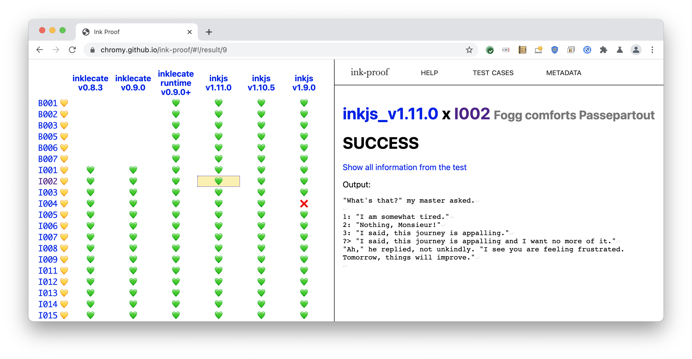

# ink-proof
*Conformance testing for [Ink](https://github.com/inkle/ink) compilers and runtimes*



[Ink](https//github.com/inkle/ink) is an open-source narrative scripting language created by [Inkle](https://www.inklestudios.com).
`ink-proof` is a tool for conformance testing Ink compilers and runtimes.

Users author interactive stories as `.ink` [files](https://github.com/inkle/ink/blob/master/Documentation/WritingWithInk.md).
Inkle provide a compiler (`inklecate`) which converts these `.ink` files to a [json based format](https://github.com/inkle/ink/blob/master/Documentation/ink_JSON_runtime_format.md) which is then interpreted by a C# runtime.
There are other compiler and runtime implementations at various levels of completeness.
For example [inkjs](https://github.com/y-lohse/inkjs), [godot-ink](https://github.com/paulloz/godot-ink), [inkcpp](https://github.com/brwarner/inkcpp).

`ink-proof` consists of a number of `.ink` and `.json` test cases.
Each test case contains a `.ink` or `.json` source file, an input file, and an expected output or "transcript" file.
`ink-proof` runs each test case against every runtime and compiler and compares the actual output to the expected output.
Results are generated as a webpage for easy viewing.

The latest public run of `ink-proof` is available at https://chromy.github.io/ink-proof however you can also run the tool offline as follows:

```bash
git clone https://github.com/chromy/ink-proof.git
cd ink-proof
python3 install_deps.py
python3 proof.py --serve
# Now navigate to http://localhost:8080
```

## Test cases
`ink-proof` has two kinds of test cases: ".ink" test cases and ".json" test cases.

Ink test cases live under the [ink](ink) directory. They consist of a `story.ink` file (for example [ink/I002/story.ink](ink/I002/story.ink)), an [input.txt](ink/I002/input.txt) file, an expected output file named [transcript.txt](ink/I002/transcript.txt), and metadata in a file named [metadata.json](ink/I002/metadata.json).

Json test cases live under the [bytecode](bytecode) directory.
They consist of a `.json` file (for example [bytecode/B005/story.json](bytecode/B005/story.json)), an [input.txt](bytecode/B005/input.txt) file, an expected output file named [transcript.txt](bytecode/B005/transcript.txt), and metadata in a file named [metadata.json](bytecode/B005/metadata.json).

## Compiler and runtime drivers
`ink-proof` can test both Ink compilers and Ink runtimes.
To do this it uses small shim programs which wrap each compiler or runtime to provide a consistant interface.
These shim programs live in the [driver](driver) directory.

Compiler drivers are named with the suffix `_compiler_driver`, for example [inklecate_v0.9.0_compiler_driver](drivers/inklecate_v0.9.0_compiler_driver).
During testing they are invoked as follows:
```bash
your_fancy_compiler_driver -o output.json input.ink
```

Runtime drivers are named with the suffix `_runtime_driver`, for example [inkjs_v1.9.0_runtime_driver](driver/inkjs_v1.9.0_runtime_driver).
During testing they are invoked (kind of) as follows:
```bash
cat input.txt | your_fancy_runtime_driver story.json >actual_output.txt
```
In other words they get passed the compiled json story as the only command line argument then they get fed each choice as input and are expected to produce the output on stdout.

This is how `inklecate` works currently so for other runtimes/compilers this means writing a wrapper to make them work like `inklecate`.

